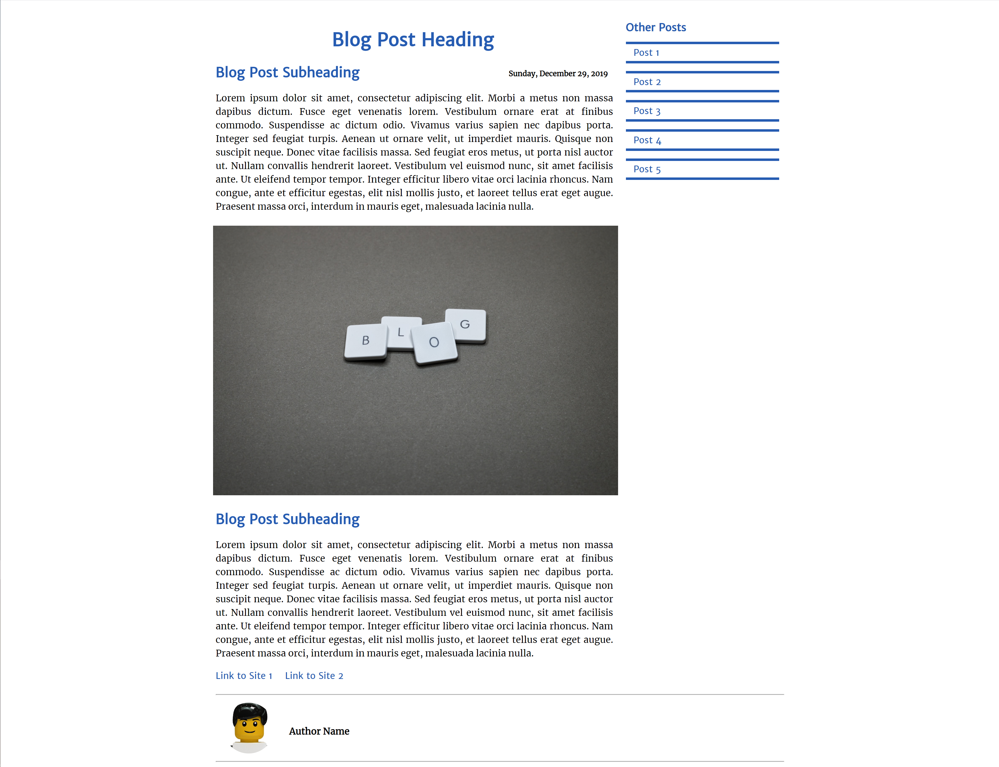

# simple_blog_layout
## Simple Blog Page Layout

### This project features a simple blog page layout created using HTML and CSS.
---

*Blog Screenshot*

---

### Technologies/Tools Used

- HTML
- CSS
- Google Fonts
- Markdown
- Brackets/Atom
- Chrome Dev Tools
- Pexels: Blog Image (Photo by Miguel Á. Padriñán from Pexels)
- Lego Author Avatar: https://randomuser.me/
- Placeholder Text: https://www.lipsum.com/

---

### For Live Demo: https://sidharthamishra.github.io/simple_blog_layout/

---
